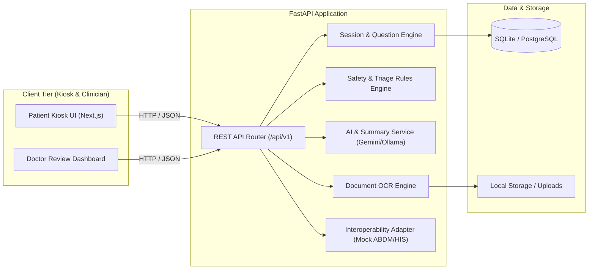

# MediKiosk System Architecture

## Architecture Overview

## Core Design Principles
1. **Separation of Concerns**: Deterministic rules govern the question trees and triage flags; AI is strictly restricted to extraction and summarization.
2. **Data Traceability**: Every summary fact is traceable back to patient voice transcript, touch selection, or OCR-extracted document text.
3. **Graceful Degradation**: If AI or network fails, the system seamlessly drops back to offline deterministic question forms.
4. **Physician Control**: The AI produces a draft; only the physician can confirm the final structured clinical record.
